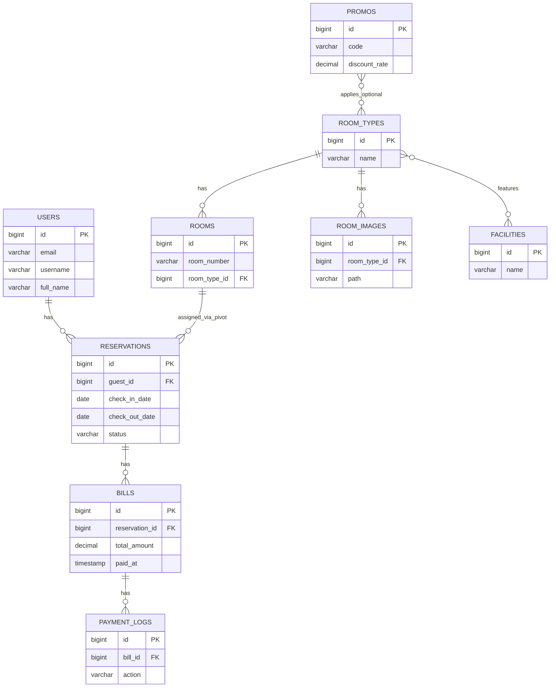
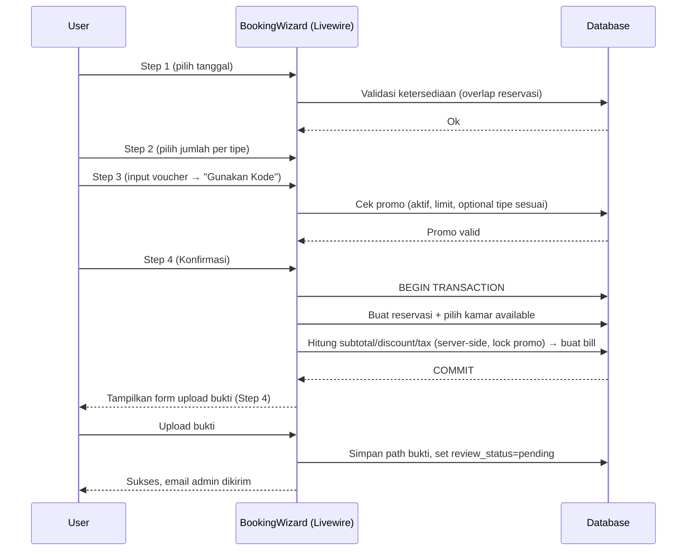

## SIHO — Sistem Informasi Hotel (Laravel + Livewire)

Dokumentasi ini menjelaskan seluruh informasi sistem: tujuan, fitur, arsitektur, cara instalasi & penggunaan, modul‑modul, alur bisnis (booking, pembayaran, voucher), konfigurasi, keamanan, serta langkah deployment.

Jika Anda ingin versi naratif per peran, lihat juga: `docs/User-Flow.md`.

## Ringkasan
- Domain: manajemen kamar & tipe, reservasi, tagihan/pembayaran, promosi/voucher, pelaporan, dan kontak.
- Peran: Publik (tanpa login), Pengguna (tamu), Admin (superadmin).
- Teknologi: Laravel 12, Livewire, Blade, Eloquent ORM, DomPDF, Queue/Mail, Vite.

## Fitur Utama
- Katalog kamar dengan filter (tipe/fasilitas/harga/kapasitas), rekomendasi, dan kalender tanggal penuh.
- Detail kamar (foto berdasarkan tipe kamar), fasilitas, rentang tanggal ter-booking, kamar serupa.
- Booking Wizard (4 langkah): tanggal → pilih jumlah kamar per tipe → ringkasan + voucher → konfirmasi & upload bukti bayar.
- Reservasi & Tagihan otomatis, unduh invoice PDF, riwayat pembayaran, pratinjau bukti pembayaran (modal fullscreen).
- Admin: kelola kamar, tipe, fasilitas, foto tipe kamar, reservasi, verifikasi pembayaran, pelaporan, contact messages, ekspor CSV.

## Arsitektur Singkat
- Backend: Laravel + Eloquent ORM (PSR‑12), arsitektur konvensi MVC.
- UI: Blade Layouts + Livewire Components (SPA‑like tanpa framework JS besar).
- PDF: DomPDF untuk invoice (isRemoteEnabled aktif untuk asset eksternal).
- Email: Queue Mail (gunakan `sync` untuk lokal dev bila belum ada worker).
- File: disk `public` untuk foto tipe kamar (`room_images`) dan bukti pembayaran (`payment_proofs`).

## Struktur Proyek
- `app/Livewire` — Komponen Livewire (Admin/Auth/Public/User/BookingWizard).
- `app/Models` — Model inti (User, Role, Rooms, RoomType, Reservations, Bills, Facility, Promo, RoomImage, PaymentLog, ContactMessage).
- `app/Http/Controllers` — PDF Invoice, Verifikasi Email, Ekspor CSV.
- `resources/views` — Blade (layouts, komponen, views Livewire, email, pdf).
- `routes/web.php` — Rute publik, user, admin; rute khusus events/exports/proof/invoice.
- `database/migrations` — Skema tabel, termasuk migrasi pemindahan foto kamar → foto tipe kamar.

## Instalasi & Konfigurasi
1) Persiapan
- `cp .env.example .env` lalu `php artisan key:generate`.
- Atur koneksi DB (MySQL) dan `APP_URL` (misal `http://127.0.0.1:8000`).
- Atur Mail untuk verifikasi & notifikasi (lokal bisa `MAIL_MAILER=log`).

2) Dependensi
- `composer install`
- `npm install`

3) Migrasi & Seed (opsional)
- `php artisan migrate` (atau `migrate:fresh --seed` untuk awal).
- Buat symlink untuk upload: `php artisan storage:link`.

4) Menjalankan
- Dev lengkap (app + queue + logs + vite): `composer run dev`.
- Server PHP: `php artisan serve`.
- Frontend dev/build: `npm run dev` / `npm run build`.
- Queue lokal (untuk mail async): `php artisan queue:work` atau set `QUEUE_CONNECTION=sync` (hanya lokal).

## Konfigurasi Penting
- DB default di `config/database.php` (MySQL/SQLite/PG) — gunakan MySQL untuk produksi.
- Disk `public` untuk upload (foto & bukti pembayaran). Pastikan `storage:link` sudah dibuat.
- Email verifikasi saat registrasi: sistem menggunakan OTP; setelah OTP benar, `email_verified_at` otomatis terisi (banner “email belum terverifikasi” tidak mengganggu). Ubah email (pending_email) tetap memakai signed URL.

## Alur Booking & Pembayaran
1) Step 1 — Tanggal
- Validasi `checkin >= today`, `checkout > checkin`. Kalender tanggal penuh (45 hari) dihitung dari ketersediaan.

2) Step 2 — Pilih Kamar per Tipe
- Pengguna memilih jumlah kamar per tipe (tanpa menampilkan individu kamar). Ketersediaan dihitung via overlap reservasi pada rentang tanggal.

3) Step 3 — Ringkasan & Voucher
- Subtotal = Σ (harga rata-rata tipe x jumlah x malam), pajak 10%, service fee flat.
- Voucher: masukkan kode → klik “Gunakan Kode” untuk menerapkan diskon; hanya aktif jika promo valid (periode, limit, opsional per tipe kamar). “Hapus” untuk membatalkan.
- Daftar promo aktif tampil sebagai chip (dapat diklik untuk diterapkan).

4) Step 4 — Konfirmasi & Upload Bukti
- Saat konfirmasi: sistem membuat `reservations`, memilih kamar available, dan membuat `bills` dengan perhitungan final (server‑side, terkunci, mencegah race condition promo).
- Form upload bukti pembayaran tampil langsung di step ini (tidak ada Step 5). Setelah upload, admin menerima notifikasi dan user diarahkan ke “Tagihan Saya”.

Catatan: Pratinjau bukti memakai route terproteksi `/user/bills/{bill}/proof` (stream file dari disk `public`) dan modal fullscreen (iframe) — tidak bergantung akses langsung `/storage/...`.

## Promo/Voucher
- Tabel `promos`: `code` unik, `discount_rate` 0..1, periode valid, `usage_limit`/`used_count`, `apply_room_type_id` (opsional).
- Validasi: aktif, dalam periode, limit belum habis, dan jika `apply_room_type_id` ditetapkan, maka tipe tersebut harus dipilih.
- Penerapan: diskon hanya aktif setelah klik “Gunakan Kode”. Perhitungan final dan increment `used_count` dilakukan saat konfirmasi (dalam transaksi dengan `lockForUpdate`).

## Modul Admin
- Rooms: CRUD kamar (nomor, lantai, harga, deskripsi, status).
- Room Types: CRUD + kapasitas, base_price, fasilitas (pivot), dan “Room Type Images”.
- Room Type Images: manajemen foto per tipe (berlaku untuk seluruh kamar pada tipe tsb). Rute: `/admin/room-types/{type}/images`.
- Reservations: buat/edit, tentukan jumlah kamar per tipe; sistem memilih kamar available dan sinkron otomatis saat delete/detach.
- Payments Review: verifikasi manual (pending → approved/rejected), kirim notifikasi ke user dan admin, unduh invoice.
- Reporting: revenue harian, occupancy (berdasarkan reservasi) per periode.
- Contacts: daftar pesan + ekspor CSV; auto-reply ke pengirim.

## Modul Pengguna
- Dashboard: ringkasan singkat.
- Reservations: daftar & detail; pada detail tampil ringkasan tipe kamar yang dipesan (nama tipe, jumlah, rata‑rata harga/malam, kapasitas, fasilitas).
- Bills: daftar tagihan; filter Paid/Pending/Rejected/Unpaid (Unpaid = belum submit bukti). Unduh invoice PDF, pratinjau bukti (modal fullscreen), upload bukti (jika belum ada atau status rejected).
- Profile: data diri (full_name, phone, address); ganti email (pending email) dengan verifikasi signed URL.

## Ketersediaan Kamar & Status
- Ketersediaan ditentukan oleh overlap periode reservasi per tanggal (bukan sekadar status global kamar). Hal ini mencegah “mengunci” kamar di tanggal yang tidak relevan.
- Status reservasi: `Confirmed`, `Checked-in`, `Completed`, `Cancelled` — mempengaruhi logika pembatalan & penghapusan.

## Kalender Ketersediaan (Admin)
- Warna per status (Confirmed/Checked‑in/Completed/Cancelled). Klik event → modal detail cepat.
- Filter: Status, Tipe Kamar, Nomor Kamar; refetch events tanpa reload.

## Keamanan & Praktik Baik
- Jangan commit `.env`/secret; gunakan `.env.example` sebagai referensi.
- Gunakan queue untuk mail di produksi (`QUEUE_CONNECTION=database`) dan jalankan worker.
- Batasi akses via middleware role di rute `admin`/`user`.
- Validasi input Livewire/Controller; semua upload file divalidasi ukuran/tipe.
- Pastikan `storage:link` dan izin folder storage/ bootstrap/cache benar.

## Deployment Ringkas
1) Siapkan server (PHP 8.2+, MySQL, Redis opsional), atur vhost ke folder `public`.
2) Pull kode, `composer install --no-dev`, `npm ci && npm run build`.
3) Salin `.env` produksi, generate `APP_KEY` bila perlu.
4) `php artisan migrate --force && php artisan storage:link`.
5) `php artisan config:cache && php artisan route:cache && php artisan view:cache`.
6) Jalankan queue worker (supervisor/systemd) untuk mail & proses async.

## Troubleshooting Cepat
- “Storage 404” saat lihat bukti: pastikan `php artisan storage:link` dan akses lewat domain yang diarahkan ke `public`. Untuk pratinjau, aplikasi menggunakan route streaming (aman meski tanpa symlink), tapi symlink diperlukan untuk gambar statis lainnya.
- Email verifikasi tidak terkirim: set `MAIL_MAILER=log` untuk lokal (cek `storage/logs/laravel.log`) atau jalankan `php artisan queue:work`.
- Error MySQL 2002 Connection refused: jalankan MySQL (XAMPP), cek kredensial `.env`, lalu `php artisan config:clear`.

## Rincian Skema Basis Data (inti)
- users: profil (`full_name`, `phone`, `address`, `id_number`, `date_of_birth`, `foto`), auth/verifikasi (`email`, `password`, `email_verified_at`, `pending_email`, `remember_token`, `role_id`)
- roles: `name`
- room_types: `name`, `description`, `base_price`, `capacity`
- rooms: `room_number`, `room_type_id`, `status`, `floor`, `description`, `price_per_night`
- reservations: `guest_id`, `check_in_date`, `check_out_date`, `status`, `special_requests`
- reservation_room: `reservation_id`, `room_id`, `assigned_at`
- bills: `reservation_id`, `subtotal_amount`, `discount_amount`, `tax_amount`, `service_fee_amount`, `total_amount`, `issued_at`, `paid_at`, `payment_method`, `payment_proof_path`, `payment_proof_uploaded_at`, `payment_review_status`, `notes`
- payment_logs: `bill_id`, `user_id`, `action`, `meta`
- promos: `code`, `name`, `discount_rate`, `apply_room_type_id` (opsional), `active`, `valid_from`, `valid_to`, `usage_limit`, `used_count`
- room_images: `room_type_id`, `path`, `sort_order`
- facilities: `name`, `icon`
- facility_room_type: `facility_id`, `room_type_id`
- contact_messages: `name`, `email`, `message`, `ip`, `read_at`

## Daftar Rute Penting
- Publik: `/`, `/rooms`, `/rooms/{room}`, `/booking`, `/booking-wizard`
- Auth: `/login`, `/register`, `/logout` (POST)
- Verifikasi Email: `/email/verify-new`, `/email/verify-current`, `/email/resend`
- User: `/user/dashboard`, `/user/reservations`, `/user/reservations/{reservation}`, `/user/bills`, `/user/bills/{bill}/invoice`, `/user/bills/{bill}/proof`, `/user/profile`
- Admin: `/admin/dashboard`, `/admin/roommanagement`, `/admin/room-type-management`, `/admin/facility-management`, `/admin/reservationmanagement`, `/admin/availability-calendar`, `/admin/housekeeping`, `/admin/reporting`, `/admin/payments`, `/admin/contacts`, `/admin/promos`
- Admin (ekspor): `/admin/users/export`, `/admin/rooms/export`, `/admin/reservations/export`, `/admin/payments/export`, `/admin/contacts/export`
- Admin (foto tipe): `/admin/room-types/{type}/images`

## Peta Komponen Livewire
- Publik: `Public/RoomsList`, `Public/RoomDetail`
- Booking: `BookingWizard`
- Auth: `Auth/Login`, `Auth/Register`, `Auth/Logout`
- User: `User/Dashboard`, `User/Reservations`, `User/ReservationDetail`, `User/Bills`, `User/Profile`
- Admin: `Admin/Dashboard`, `Admin/RoomManagement`, `Admin/RoomTypeManagement`, `Admin/FacilityManagement`, `Admin/ReservationManagement`, `Admin/AvailabilityCalendar`, `Admin/HousekeepingManagement`, `Admin/PaymentsReview`, `Admin/ContactMessages`, `Admin/PromoManagement`, `Admin/RoomTypeImages`

## Panduan Operasi Admin
- Verifikasi Pembayaran: tinjau bukti → Approve (set `paid_at`, kirim email ke user/admin) atau Reject (user dapat upload ulang)
- Promo/Voucher: buat kode unik, `discount_rate` (0..1), periode valid, `usage_limit`, opsional kunci ke tipe kamar (`apply_room_type_id`)
- Foto Tipe Kamar: unggah/hapus di `/admin/room-types/{type}/images`; berlaku untuk semua kamar pada tipe tsb
- Reservasi: tentukan jumlah kamar per tipe; sistem memilih kamar available; hapus reservasi mengembalikan ketersediaan tanggal terkait

## Backup & Restore
- Backup: `mysqldump db > backup.sql` + arsipkan `storage/app/public/`
- Restore: `mysql db < backup.sql` + pulihkan `storage/app/public/` + `php artisan storage:link`

## Panduan Migrasi Foto Kamar → Foto Tipe Kamar
- Migrasi `2025_08_27_010000_update_room_images_to_room_type.php` menambahkan `room_type_id` dan memetakan data lama
- Jalankan `php artisan migrate` lalu kelola foto via `/admin/room-types/{type}/images`

## Kontribusi & Gaya Kode
- PSR‑12, gunakan `./vendor/bin/pint` sebelum commit; Livewire + Blade untuk UI; hindari menaruh secret di repo

## Tabel Rute Lengkap (Ringkas)

| Method | Path | Name | Middleware |
| --- | --- | --- | --- |
| GET | `/` | `home` | web |
| GET | `/rooms` | `rooms` | web |
| GET | `/rooms/{room}` | `rooms.detail` | web |
| GET | `/booking` | `booking` | web |
| GET | `/booking-wizard` | `booking.wizard` | auth |
| GET | `/login` | `login` | web, guest |
| GET | `/register` | `register` | web, guest |
| POST | `/logout` | `logout` | auth |
| GET | `/email/verify-new` | `verification.new` | signed |
| GET | `/email/verify-current` | `verification.current` | signed, auth |
| GET | `/email/resend` | `verification.resend` | auth |
| GET | `/user/dashboard` | `user.dashboard` | auth, role:user,users |
| GET | `/user/reservations` | `user.reservations` | auth, role:user,users |
| GET | `/user/reservations/{reservation}` | `user.reservations.show` | auth, role:user,users |
| GET | `/user/bills` | `user.bills` | auth, role:user,users |
| GET | `/user/bills/{bill}/invoice` | `user.bills.invoice` | auth, role:user,users |
| GET | `/user/bills/{bill}/proof` | `user.bills.proof` | auth, role:user,users |
| GET | `/user/profile` | `user.profile` | auth, role:user,users |
| GET | `/admin/dashboard` | `admin.dashboard` | auth, role:superadmin |
| GET | `/admin/roommanagement` | `admin.room.management` | auth, role:superadmin |
| GET | `/admin/room-type-management` | `admin.room-type.management` | auth, role:superadmin |
| GET | `/admin/facility-management` | `admin.facility.management` | auth, role:superadmin |
| GET | `/admin/reservationmanagement` | `admin.reservation.management` | auth, role:superadmin |
| GET | `/admin/availability-calendar` | `admin.availability.calendar` | auth, role:superadmin |
| GET | `/admin/calendar-events` | `admin.calendar.events` | auth, role:superadmin |
| GET | `/admin/housekeeping` | `admin.housekeeping.management` | auth, role:superadmin |
| GET | `/admin/reporting` | `admin.reporting` | auth, role:superadmin |
| GET | `/admin/payments` | `admin.payments` | auth, role:superadmin |
| GET | `/admin/promos` | `admin.promos` | auth, role:superadmin |
| GET | `/admin/contacts` | `admin.contacts` | auth, role:superadmin |
| GET | `/admin/users/export` | `admin.users.export` | auth, role:superadmin |
| GET | `/admin/rooms/export` | `admin.rooms.export` | auth, role:superadmin |
| GET | `/admin/reservations/export` | `admin.reservations.export` | auth, role:superadmin |
| GET | `/admin/payments/export` | `admin.payments.export` | auth, role:superadmin |
| GET | `/admin/contacts/export` | `admin.contacts.export` | auth, role:superadmin |
| GET | `/admin/room-types/{type}/images` | `admin.room-type.images` | auth, role:superadmin |

Catatan: `/admin/rooms/{room}/images` di‑redirect ke `admin.room-type.images` (legacy).

## Rincian Kolom per Tabel (Inti)

Contoh ringkas (tidak semua kolom ditampilkan):

| Tabel | Kolom (tipe) |
| --- | --- |
| users | id BIGINT, role_id FK, username VARCHAR, email VARCHAR UNIQUE, email_verified_at DATETIME NULL, pending_email VARCHAR NULL, password VARCHAR, full_name VARCHAR, phone VARCHAR, address TEXT, id_number VARCHAR NULL, date_of_birth DATE NULL, foto VARCHAR NULL, timestamps |
| room_types | id, name VARCHAR, description TEXT NULL, base_price DECIMAL(12,2) NULL, capacity INT NULL, timestamps |
| rooms | id, room_number VARCHAR UNIQUE, room_type_id FK, status ENUM('Available','Occupied','Cleaning',..), floor INT, description TEXT NULL, price_per_night DECIMAL(12,2), timestamps |
| reservations | id, guest_id FK(users), check_in_date DATE, check_out_date DATE, status ENUM('Confirmed','Checked-in','Completed','Cancelled'), special_requests TEXT NULL, timestamps |
| reservation_room | reservation_id FK, room_id FK, assigned_at TIMESTAMP NULL |
| bills | id, reservation_id FK, subtotal_amount DECIMAL(12,2), discount_amount DECIMAL(12,2), tax_amount DECIMAL(12,2), service_fee_amount DECIMAL(12,2), total_amount DECIMAL(12,2), issued_at TIMESTAMP, paid_at TIMESTAMP NULL, payment_method VARCHAR NULL, payment_review_status ENUM('pending','approved','rejected') NULL, payment_proof_path VARCHAR NULL, payment_proof_uploaded_at TIMESTAMP NULL, notes TEXT NULL, timestamps |
| payment_logs | id, bill_id FK, user_id FK, action VARCHAR, meta JSON NULL, timestamps |
| promos | id, code VARCHAR UNIQUE, name VARCHAR, discount_rate DECIMAL(5,2), apply_room_type_id FK NULL, active TINYINT, valid_from TIMESTAMP NULL, valid_to TIMESTAMP NULL, usage_limit INT NULL, used_count INT DEFAULT 0, timestamps |
| room_images | id, room_type_id FK, path VARCHAR, sort_order INT, timestamps |
| facilities | id, name VARCHAR, icon VARCHAR NULL, timestamps |
| facility_room_type | facility_id FK, room_type_id FK |

## Contoh Query Laporan

- Revenue per hari (rentang tanggal):
```sql
SELECT DATE(issued_at) AS day, SUM(total_amount) AS revenue
FROM bills
WHERE issued_at BETWEEN :from AND :to
GROUP BY DATE(issued_at)
ORDER BY day;
```

- Occupancy (jumlah reservasi aktif per hari vs total kamar):
```sql
-- active reservations overlapping a given day :d
SELECT COUNT(DISTINCT rr.room_id) AS occupied_rooms
FROM reservations r
JOIN reservation_room rr ON rr.reservation_id = r.id
WHERE r.check_out_date > :d AND r.check_in_date <= :d;
```

- Tagihan pending menunggu verifikasi:
```sql
SELECT COUNT(*) FROM bills WHERE paid_at IS NULL AND payment_review_status = 'pending';
```

## Checklist QA (Sebelum Rilis)

- Booking Wizard
  - [ ] Tanggal valid/invalid (masa lalu, checkout <= checkin)
  - [ ] Ketersediaan: pilih beberapa tipe, verifikasi perhitungan malam
  - [ ] Voucher: valid/expired/limit habis/terkunci tipe; tombol “Gunakan Kode”; ubah pilihan setelah voucher diterapkan
  - [ ] Konfirmasi: pembuatan reservation + bill; total sesuai kalkulasi server
  - [ ] Upload bukti: format/ukuran validasi, muncul di Tagihan → Pending

- Tagihan (User)
  - [ ] Filter Paid/Pending/Rejected/Unpaid sesuai definisi
  - [ ] Unduh invoice PDF
  - [ ] Pratinjau bukti (modal fullscreen) bekerja

- Payments Review (Admin)
  - [ ] Approve → `paid_at` terisi, email terkirim, log tercatat
  - [ ] Reject → user dapat upload ulang

- Gambar kamar
  - [ ] Foto tipe kamar ditampilkan di daftar/detail kamar publik
  - [ ] Manajemen foto hanya di `/admin/room-types/{type}/images`

- Profil & Email
  - [ ] Registrasi via OTP menandai email terverifikasi
  - [ ] Ganti email (pending) → kirim link verifikasi, banner dapat di‑dismiss

- Infrastruktur & Keamanan
  - [ ] `storage:link` aktif, izin folder storage/bootstrap/cache benar
  - [ ] `APP_ENV=production`, `APP_DEBUG=false`, `APP_URL` benar
  - [ ] Queue worker berjalan (jika MAIL async)
  - [ ] Cache: config/route/view cache diaktifkan di produksi

## Lisensi
Kode dalam repositori ini mengikuti lisensi proyek Anda. Komponen Laravel tetap berlisensi MIT.

## Diagram (Mermaid)

ERD Ringkas:


Sequence — Booking Wizard:


## FAQ Operasional (Admin/User)
- Mengapa voucher tidak memotong harga?
  - Pastikan klik tombol “Gunakan Kode”. Voucher harus masih aktif, belum melewati `usage_limit`, dan (jika dikunci ke tipe) tipe kamar tersebut dipilih. Bila setelah dipakai Anda mengubah pilihan kamar sehingga tidak cocok lagi, diskon jadi 0 hingga voucher dihapus/diubah.
- Mengapa pratinjau bukti menampilkan 404 atau hanya alt text?
  - Aplikasi men‑stream bukti via `/user/bills/{bill}/proof`. Pastikan login sebagai pemilik tagihan. Untuk gambar statis lain gunakan `php artisan storage:link` dan jalankan dari domain yang menunjuk ke folder `public`.
- Tagihan masuk “Unpaid” padahal saya sudah upload bukti?
  - “Unpaid” didefinisikan sebagai tagihan yang belum memulai proses pembayaran (tidak ada bukti, tidak ada review). Setelah upload bukti, status masuk “Pending” hingga diverifikasi.
- Kapan kamar dianggap tersedia?
  - Berdasarkan overlap tanggal reservasi (bukan status global kamar). Hari yang tidak tercover reservasi dianggap tersedia.
- Di mana saya mengelola foto kamar?
  - Foto terpusat di tipe kamar: `/admin/room-types/{type}/images`. Semua kamar pada tipe yang sama berbagi foto yang sama.
- Verifikasi email bagaimana?
  - Saat registrasi, OTP yang benar menandai email terverifikasi. Mengganti email (pending email) membutuhkan klik tautan verifikasi bertanda tangan (signed URL) yang dikirim ke email baru.

## Contoh Skenario Lengkap (End‑to‑End)
1) Admin membuat promo 10% khusus tipe “Deluxe” (usage_limit=100, periode 1 bulan)
2) User pilih tanggal menginap 2 malam, pilih 2 kamar tipe “Deluxe”
3) Di Step 3, user memasukkan kode dan menekan “Gunakan Kode” → diskon tampil
4) Di Step 4, user konfirmasi, sistem membuat reservasi + tagihan, lalu tampilkan form upload bukti
5) User mengunggah bukti → notifikasi admin, tagihan berstatus “Pending”
6) Admin meninjau di Payments Review → Approve → user menerima email berisi invoice PDF, tagihan “Paid”

## Contoh Konfigurasi .env (ringkas)
Dev (lokal):
```
APP_ENV=local
APP_DEBUG=true
APP_URL=http://127.0.0.1:8000

DB_CONNECTION=mysql
DB_HOST=127.0.0.1
DB_PORT=3306
DB_DATABASE=siho_db
DB_USERNAME=siho
DB_PASSWORD=secret

QUEUE_CONNECTION=sync
MAIL_MAILER=log

PAYMENT_BANK_NAME=BCA
PAYMENT_BANK_ACCOUNT=1234567890
PAYMENT_BANK_HOLDER=Grand Luxe Hotel
PAYMENT_BANK_NOTE=Cantumkan kode referensi pada berita transfer.
```

Prod (contoh):
```
APP_ENV=production
APP_DEBUG=false
APP_URL=https://hotel.example.com

DB_CONNECTION=mysql
DB_HOST=10.0.0.10
DB_PORT=3306
DB_DATABASE=siho
DB_USERNAME=siho
DB_PASSWORD=********

QUEUE_CONNECTION=database
MAIL_MAILER=smtp
MAIL_HOST=smtp.example.com
MAIL_PORT=587
MAIL_USERNAME=apikey
MAIL_PASSWORD=********
MAIL_ENCRYPTION=tls
MAIL_FROM_ADDRESS=no-reply@hotel.example.com
MAIL_FROM_NAME="SIHO"
```
